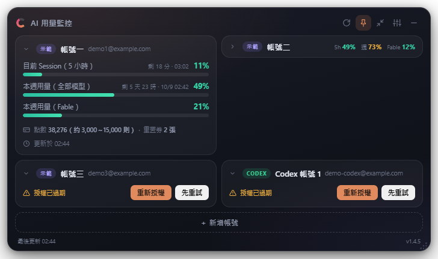
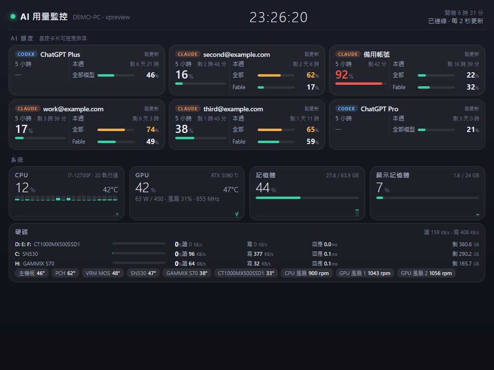
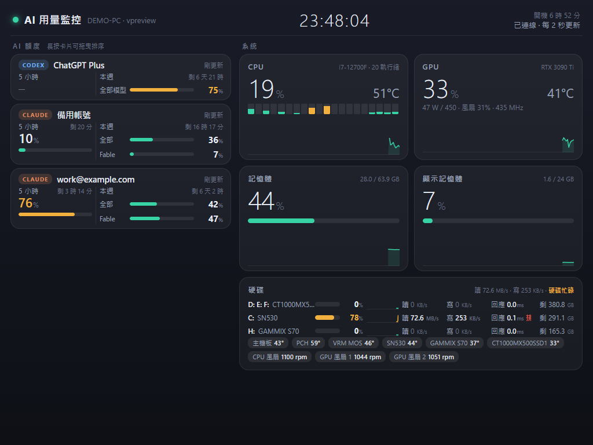
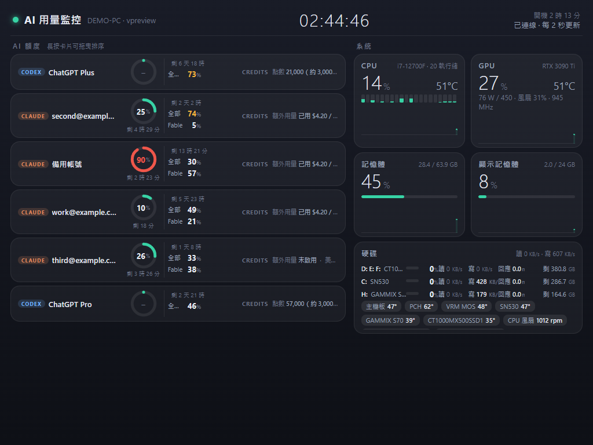
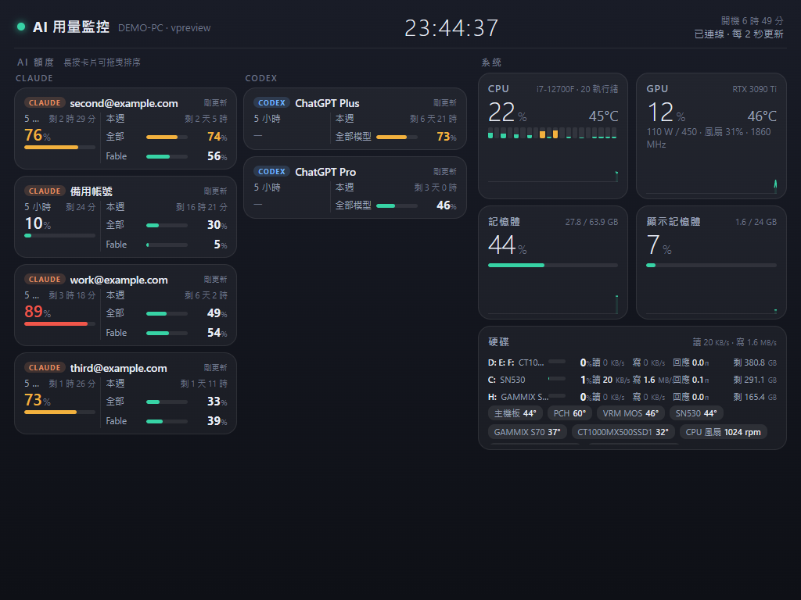
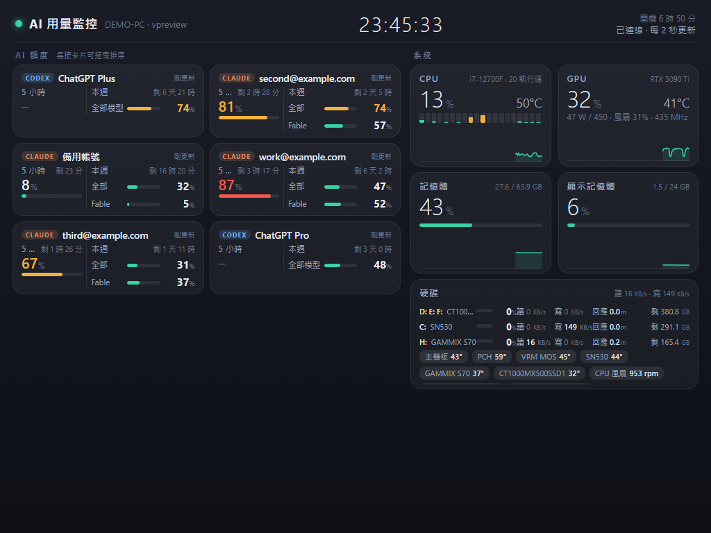
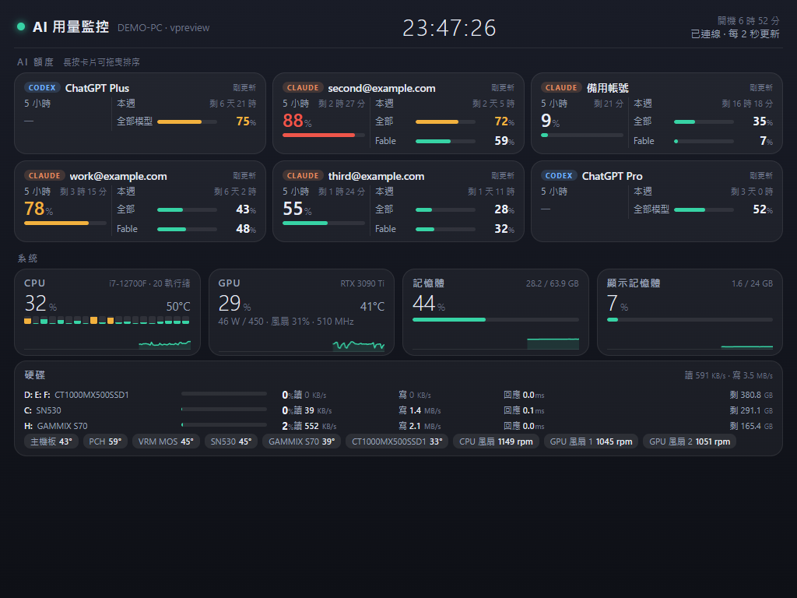
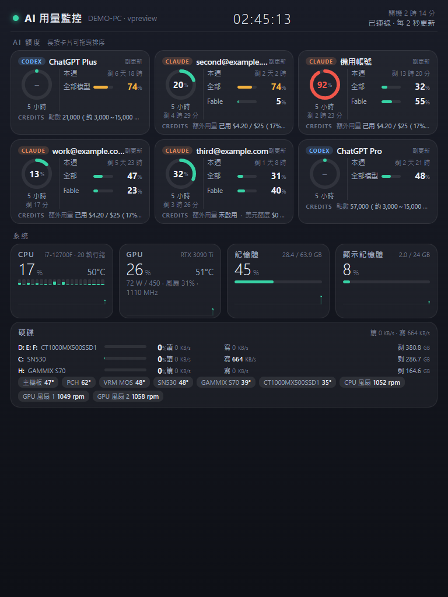

# OldPad AI Monitor · 舊平板 AI 用量監控

**Give that old iPad or tablet a second life as an always-on AI quota & PC monitor.**

A Windows desktop widget (Electron) tracks the **subscription quota** of your **Claude** and **ChatGPT Codex**
accounts — several accounts at once — and serves a **LAN dashboard** that runs
on any old tablet or phone browser (tested down to an iPad 4 on iOS 10), showing the same quota plus the
PC's CPU / GPU / RAM / disk activity and temperatures.

**讓淘汰的舊 iPad／平板重新上工，變成常駐的 AI 額度＋電腦狀態監測螢幕。**
Windows 桌面小窗（Electron）同時追蹤多個 **Claude**、**ChatGPT Codex** 帳號的訂閱額度
（5 小時窗、每週、分模型），並提供一個**區網儀表板**，舊 iPad／手機開瀏覽器就能常駐顯示額度＋電腦的
CPU／GPU／記憶體／硬碟讀寫／溫度（最舊實測到 iPad 4、iOS 10）。[繁體中文說明在下方](#繁體中文說明)。




> **Unofficial. Use at your own risk.**
> This tool talks to the same OAuth endpoints the official CLIs use (Claude Code, Codex CLI).
> Those endpoints are undocumented and can change or be restricted at any time; when that happens the
> tool simply stops showing numbers until it is updated. Nothing is sent anywhere except to those vendors'
> own servers, and tokens are stored only on your PC (encrypted with Windows DPAPI).

## Features

- **Multiple accounts per provider** (e.g. three Claude subscriptions with different weekly reset times).
- Session (5-hour) window, weekly quota, per-model quota (e.g. a model-scoped weekly limit), with a
  countdown to the next reset on the same line.
- **Claude** — Claude Code's OAuth flow (paste the authorization code). Reads `api.anthropic.com/api/oauth/usage`.
- **ChatGPT Codex** — Codex CLI's "Sign in with ChatGPT" flow (automatic local callback). Reads the Codex rate-limit endpoint.
- Robust token refresh: only a definitive `invalid_grant` / 401 / 403 marks an account as needing re-login;
  network blips, sleep/wake and 5xx are retried with back-off; refresh tokens are kept alive proactively.
- Resizable, collapsible cards, drag to reorder, 1–3 columns, compact mode, tray icon with a usage gauge.
- **LAN dashboard** (`http://<pc-ip>:3801`): ES5 + XHR + flexbox on purpose so it runs on iOS 9/10 Safari.
  Shows every account's quota, CPU (per-core), GPU (nvidia-smi), RAM, VRAM, per-disk busy % / read / write /
  response time, and temperatures/fans via [LibreHardwareMonitor](https://github.com/LibreHardwareMonitor/LibreHardwareMonitor)
  if it is running. Cards can be reordered by long-press drag; the order is saved on the PC.
- Only private-network clients are accepted (RFC1918, Tailscale), the `Host` header must be an IP literal
  (DNS-rebinding protection), and the dashboard JSON **never contains tokens**.

## Install

1. Download `OldPad-AI-Monitor-Setup-<version>.exe` from **Releases** and run it (the installer is not
   code-signed, so Windows SmartScreen will show a warning: *More info → Run anyway*).
2. Launch *OldPad AI Monitor* from the desktop shortcut. It lives in the tray; the window floats on top.
3. Click **連接帳號** (connect account) and pick a provider:
   - **Claude** — the browser opens claude.ai; sign in, click *Authorize*, copy the long code from the
     result page and paste it into the widget. To add a *second* account, open the authorization link in a
     private/incognito window.
   - **ChatGPT Codex** — the browser opens the ChatGPT login; after *Authorize* the widget picks the result up
     automatically (local port 1455).
4. Usage refreshes every 5 minutes by default (1–30 min in settings).

### Updates

The installed app checks GitHub Releases 30 s after start and every 6 hours, downloads a new version in the
background and shows **「重新啟動更新到 vX.Y.Z」** in the footer (also in the tray menu). Click it, or just
quit the app — the update installs on exit. Updates replace the program files only; your accounts, tokens and
settings live in `%APPDATA%\ai-usage-monitor` and are untouched. Turn the check off in settings
(*自動更新*) if you prefer to update by hand. Versions before 1.4.4 do not update themselves — install 1.4.4
once manually.

### Run from source

```bash
npm install
npm start          # the widget
npm test           # unit tests (no window needed)
npm run smoke      # off-screen render → smoke.png, exits by itself
npm run dist       # Windows installer → dist/ (also dist/latest.yml + .blockmap for auto-update)
node scripts/preview-dashboard.js 7801   # dashboard with demo data, no Electron
```

**Releasing**: bump `version` in `package.json`, tag `vX.Y.Z` and push — the GitHub Action builds and attaches
`OldPad-AI-Monitor-Setup-X.Y.Z.exe`, its `.blockmap` and `latest.yml` to the release. Installed copies pick the new
version up from `latest.yml`, so all three files must be on the release (when releasing by hand, upload all three).

## LAN dashboard on a tablet

1. Open the settings panel (slider icon) → **iPad／手機儀表板** → copy the URL shown (e.g. `http://192.168.1.20:3801`).
2. If Windows asks about the firewall, allow both *Private* and *Public*. If the tablet still cannot connect,
   run `scripts/windows-helpers/允許防火牆-iPad儀表板.bat` (sets the network to *Private* and adds a rule for port 3801).
3. Open the URL in Safari/Chrome on the tablet. On iOS use *Share → Add to Home Screen* for a full-screen view
   and set auto-lock to *Never*.
4. Optional temperatures/fans: put LibreHardwareMonitor in `C:\Tools\LibreHardwareMonitor` together with the
   provided `LibreHardwareMonitor.config` (remote web server on port 8085) and run
   `scripts/windows-helpers/安裝溫度監測-LibreHardwareMonitor.bat`, which registers it as an elevated logon task.

With more than five accounts the dashboard switches to a "quota on top" layout; add `?layout=rows`,
`?layout=grouped` or `?layout=wall` to the URL for alternatives.

### Dashboard layouts (demo data)

| | |
|---|---|
| **Up to 5 accounts** — quota column on the left, system tiles on the right.  | **6+ accounts, default "quota on top"** — three cards per row, system tiles in one strip.  |
| **`?layout=rows`** — one account per line, easy to scan top-down.  | **`?layout=grouped`** — Claude on the left, other providers on the right.  |
| **`?layout=wall`** — the compact two-column card wall.  | **Long-press drag to reorder** — the lifted card follows your finger, others make room; order is saved on the PC.  |

Portrait (768 px wide) stacks quota above the system tiles:



Every card shows the 5-hour window (big number + countdown) and the weekly quota (overall + per-model rows).
Cards go grey when the PC has not refreshed that account for 20 minutes.

## Troubleshooting

- **"授權已過期 / needs re-login" on a card** — press **先重試** first. Only a server-side rejection is treated
  as a real expiry. Every refresh result is logged to `%APPDATA%\ai-usage-monitor\events.log`.
- **`listen EACCES` on 3801, or CPU temperature disappears although LibreHardwareMonitor is running** —
  Hyper-V / WSL reserve random port ranges at boot when the TCP dynamic port range starts low.
  `scripts/windows-helpers/保留埠號-修CPU溫度消失.bat` restores the default dynamic range (49152+),
  adds a URL ACL for port 8085 and restarts LibreHardwareMonitor.
- **Raw API responses** for debugging are kept in `%APPDATA%\ai-usage-monitor\debug\` (one file per account, no tokens).

## Privacy & security

- Tokens live in `%APPDATA%\ai-usage-monitor\accounts.json`, encrypted with DPAPI for the current Windows user.
- The app only calls the vendors' own endpoints listed in `src/constants.js`. No telemetry, no third-party server.
- The OAuth client identifiers in `src/constants.js` are the public identifiers of the official desktop
  clients (Claude Code, Codex CLI). They are included so the tool works out of the box; they are
  not this project's secrets. If a vendor objects, the corresponding provider will be removed.

## Project layout

| Path | What |
|---|---|
| `main.js` | Electron main process: window, tray, IPC, auth orchestration, LAN server lifecycle |
| `src/oauth*.js` | Claude / OpenAI OAuth (PKCE, local callback server, refresh with failure classification) |
| `src/providers/*.js` | Per-provider usage fetch + normalisation into a common bucket shape |
| `src/poller.js` | Scheduler: refresh-before-expiry, keep-alive refresh, back-off, transient vs definitive errors |
| `src/lan-server.js` | LAN HTTP server (static files, `/api/state`, `POST /api/order`) with private-network checks |
| `src/sysmetrics.js` | CPU / RAM / disk space / per-disk I/O counters (wmic → CIM fallback) / nvidia-smi / LibreHardwareMonitor |
| `renderer/` | Widget UI (layout.js = density tiers + CSS zoom) |
| `dashboard/` | Tablet dashboard (ES5, iOS 9/10 compatible) |
| `test/units.js` | Unit tests (`npm test`) |

## License

**Free for noncommercial use** under the [PolyForm Noncommercial License 1.0.0](LICENSE) — personal use,
hobby projects, research, education, charities and government are all fine. **Commercial use** (selling it,
bundling it into a paid product or service, or using it inside a for-profit company's operations) is not
covered; contact the author for a commercial license. © 2026 Antor. Contributions are welcome, but by
submitting a pull request you agree that the author may relicense your contribution under any terms.

---

## 繁體中文說明

### 這是什麼

一個放在桌面角落的小視窗，一眼看到每個 AI 帳號「這 5 小時用了幾 %、本週用了幾 %、什麼時候重置」。
支援多個 Claude 帳號（週重置時間各不同時特別好用）與 ChatGPT Codex。
另外內建區網儀表板：家裡淘汰的 iPad／手機開瀏覽器就能當常駐監測螢幕，連十幾年前的 iPad 4（iOS 10）都能跑，
除了額度還有電腦的 CPU／GPU／記憶體／每顆硬碟的忙碌％與讀寫速度／溫度風扇。

> **非官方工具，風險自負。** 它走的是 Claude Code、Codex CLI 這些官方程式同一套登入與查詢端點，
> 這些端點沒有公開文件，官方隨時可能改或限制；改了就會抓不到數字，等更新即可。資料只會送到各家官方伺服器，
> 授權憑證只存在你的電腦（Windows DPAPI 加密）。

### 安裝與連接帳號

1. 到 **Releases** 下載 `OldPad-AI-Monitor-Setup-<版本>.exe` 執行（沒有數位簽章，Windows 會跳藍色警告：其他資訊 → 仍要執行）。
2. 桌面捷徑打開後程式在右下角系統列，視窗浮在最上層。
3. 按「連接帳號」選服務：
   - **Claude**：瀏覽器開授權頁 → 登入 → Authorize → 把網頁上的一長串授權碼整段複製貼回小工具。
     連第二個帳號時請用「複製授權連結」貼到**無痕視窗**開，才不會又授權到同一個帳號。
   - **ChatGPT Codex**：瀏覽器登入 → 同意 → 小工具自動接手（本機 1455 埠）。
4. 預設每 5 分鐘更新一次，設定裡可調 1～30 分鐘。
5. **自動更新（1.4.4 起）**：程式啟動 30 秒後與之後每 6 小時會到 GitHub Releases 檢查新版，有的話在背景下載，
   下載完頁尾會出現「重新啟動更新到 vX.Y.Z」按鈕（系統列選單也有）；不按也沒關係，下次關閉程式時自動安裝。
   更新只換程式本體，帳號授權與設定都在 `%APPDATA%\ai-usage-monitor`，不會被清掉。設定裡可以關掉自動更新。

### iPad／手機儀表板

1. 設定面板（滑桿圖示）→「iPad／手機儀表板」→ 複製網址，例如 `http://192.168.1.20:3801`。
2. Windows 跳防火牆詢問時「私人」「公用」都勾。平板連不上就雙擊 `scripts/windows-helpers/允許防火牆-iPad儀表板.bat`。
3. 平板瀏覽器開那個網址；iOS 用「分享 → 加入主畫面」變全螢幕，自動鎖定設「永不」。
4. 想看 CPU 溫度／風扇：把 LibreHardwareMonitor 解壓到 `C:\Tools\LibreHardwareMonitor`、放入附的 `LibreHardwareMonitor.config`，
   雙擊 `安裝溫度監測-LibreHardwareMonitor.bat`，它會登錄成開機自動啟動（管理員）。
5. 帳號超過 5 個會自動切成「額度置頂」版面；卡片**長按 0.3 秒可拖曳換位**，順序記在電腦端。
   網址後加 `?layout=rows`／`grouped`／`wall` 可換版面。各版面長相見上方 [Dashboard layouts](#dashboard-layouts-demo-data)
   （都是示範資料）：帳號 5 個以內＝左額度右系統；6 個以上預設額度置頂一列三張；`rows` 單欄列表；
   `grouped` 依服務分兩欄；`wall` 兩欄卡片牆；直放時額度在上、系統在下。資料超過 20 分鐘沒更新的卡片會變灰。

### 常見問題

- **卡片說授權過期**：先按「先重試」。只有服務端明確拒絕才算真的過期；每次續期結果都記在 `%APPDATA%\ai-usage-monitor\events.log`。
- **3801 埠 EACCES、或溫度程式在跑但 CPU 溫度不見**：Hyper-V／WSL 開機會隨機保留一段埠號。
  雙擊 `保留埠號-修CPU溫度消失.bat`，它會把動態埠範圍改回 Windows 預設（49152 起）、幫 8085 加網址授權並重啟溫度程式。
- **要除錯**：`%APPDATA%\ai-usage-monitor\debug\` 有每個帳號最近一次的原始回應（不含憑證）。

### 授權

採用 [PolyForm Noncommercial 1.0.0](LICENSE)：**個人、研究、教育、非營利組織免費使用與修改**；
**商業用途**（拿去賣、包進付費產品或服務、營利公司內部使用）不在授權範圍內，請聯絡作者取得商業授權。
© 2026 Antor。歡迎提交修改，但送出 pull request 即同意作者可以用任何條款重新授權該貢獻。
